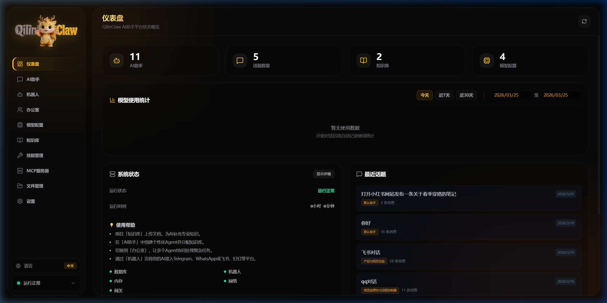
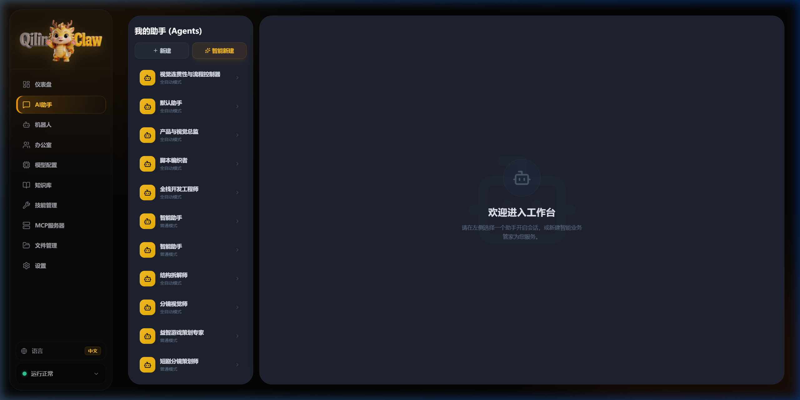
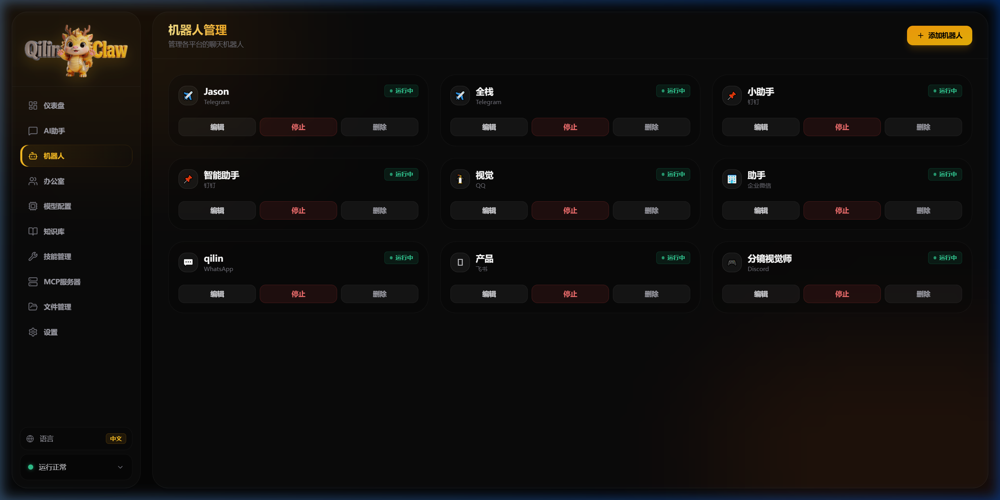
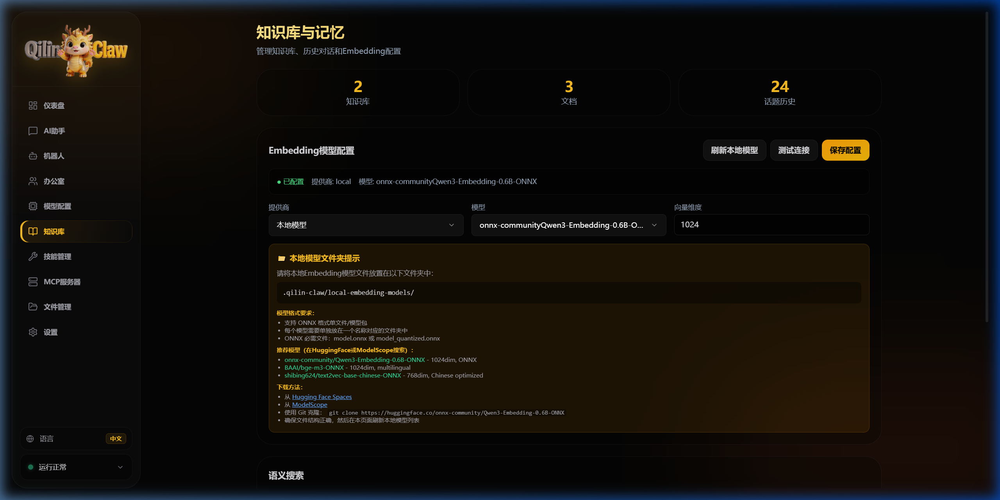
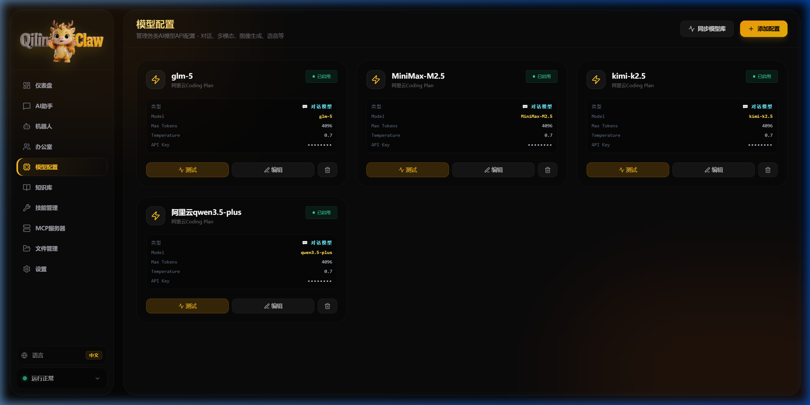
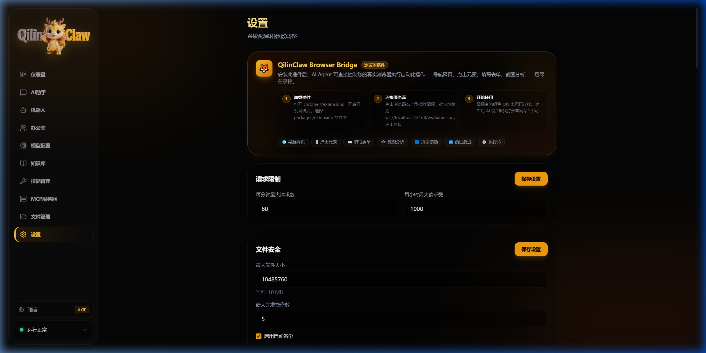

<p align="center">
  
</p>

<h1 align="center">🐉 QilinClaw</h1>

<p align="center">
  <strong>Open-source AI Assistant Platform — Visual, Multi-Agent, Multi-Platform</strong>
</p>

<p align="center">
  English | <a href="README_CN.md">中文</a>
</p>


<p align="center">
  <a href="#-quick-start">Quick Start</a> •
  <a href="#-features">Features</a> •
  <a href="#-screenshots">Screenshots</a> •
  <a href="#-architecture">Architecture</a> •
  <a href="#-faq">FAQ</a>
</p>

---

## ✨ What is QilinClaw?

QilinClaw is a **self-hosted AI assistant platform** that lets you create, manage, and deploy AI agents with a beautiful visual interface. No command-line expertise needed — **if you can recognize icons, you can use QilinClaw.**

### 🎯 Key Highlights

- 🖥️ **Fully Visual WebUI** — every feature has a point-and-click interface, zero config files to edit
- 🤖 **Multi-Agent System** — create multiple AI agents with different personalities, skills, and models
- 💬 **Multi-Platform Bots** — connect your agents to Telegram, Discord, WeChat, DingTalk, Feishu, WhatsApp, QQ, Slack, and more
- 🧠 **Knowledge Base (RAG)** — upload documents, build knowledge bases, agents auto-retrieve relevant info
- 🏢 **Office Collaboration** — create team spaces where multiple agents collaborate on tasks
- 🔌 **MCP Protocol** — extend agent capabilities with Model Context Protocol servers
- 🌐 **Browser Automation** — agents can control your real browser via Chrome extension
- 🖱️ **GUI Automation** — agents can operate your desktop (click, type, screenshot)
- 🌍 **Bilingual UI** — full Chinese/English interface, switch with one click
- 🔒 **Local-First** — all data stays on your machine, no cloud dependency

---

## 📋 Prerequisites

Before installing QilinClaw, make sure you have the following software installed:

| Software | Version | Required | Download |
|----------|---------|----------|----------|
| **Node.js** | v20 LTS or later | ✅ Yes | [nodejs.org](https://nodejs.org/) |
| **npm** | v9+ (comes with Node.js) | ✅ Yes | Included with Node.js |
| **Git** | Any recent version | ✅ Yes | [git-scm.com](https://git-scm.com/) |
| **Python** | 3.8+ | ❌ Optional | [python.org](https://www.python.org/) |

> **Note:** Python is only needed if you want to use local embedding models for the knowledge base. Everything else works without it.

### Supported Operating Systems

- ✅ **Windows** 10/11 (primary, fully tested)
- ✅ **macOS** (Node.js compatible)
- ✅ **Linux** (Node.js compatible)

---

## 🚀 Quick Start

### 1. Clone the Repository

```bash
git clone https://github.com/caicaichuangzhao/qilinclaw.git
cd qilinclaw
```

### 2. Install & Build

```bash
node bin/qilinclaw.js install
```

This single command will:
- 📦 Install all dependencies
- 🔨 Build the server and client
- ⏰ Register auto-start on login (Windows)

### 3. Launch

```bash
node bin/qilinclaw.js gateway
```

The WebUI will **automatically open in your browser** at `http://127.0.0.1:18168/`.

That's it! 🎉

### CLI Commands

| Command | Description |
|---------|-------------|
| `node bin/qilinclaw.js install` | Install dependencies and build |
| `node bin/qilinclaw.js gateway` | Start the gateway (auto-opens browser) |
| `node bin/qilinclaw.js gateway --no-browser` | Start without opening browser |
| `node bin/qilinclaw.js doctor` | Check environment & dependencies |
| `node bin/qilinclaw.js uninstall` | Clean up everything |

---

## 🖼️ Screenshots

### Dashboard
> Real-time system overview — agents, conversations, models, and system health at a glance.



### AI Agents
> Create and manage intelligent agents. Each agent has its own personality, model, skills, and knowledge base.



### Multi-Platform Bots
> Connect your agents to messaging platforms with visual configuration. No API code needed.



### Knowledge Base
> Upload documents (PDF, Word, TXT, etc.) and build searchable knowledge bases with vector embeddings.



### Model Configuration
> Browse and configure 100+ AI models from multiple providers — OpenAI, Claude, Gemini, DeepSeek, Qwen, and more.



### Settings
> System configuration, safety settings, memory management, and browser extension setup.



---

## ⭐ Features

### 🤖 AI Agent Management

| Feature | Description |
|---------|-------------|
| **Smart Creation** | Describe what you want in natural language, QilinClaw creates the agent for you |
| **Custom Agents** | Fine-tune system prompts, personality, and behavior |
| **Multi-Model** | Each agent can use a different AI model (GPT-4, Claude, Gemini, etc.) |
| **Agent Skills** | Equip agents with tools: web search, file operations, code execution, and more |
| **Conversation History** | Full chat history with edit, delete, and recall capabilities |
| **Workspace** | Built-in code editor, file browser, and terminal for agent tasks |

### 💬 Bot Platform Integration

Connect agents to any messaging platform:

| Platform | Status | Platform | Status |
|----------|--------|----------|--------|
| Telegram | ✅ | Discord | ✅ |
| WeChat Work (企业微信) | ✅ | DingTalk (钉钉) | ✅ |
| Feishu (飞书) | ✅ | WhatsApp | ✅ |
| QQ | ✅ | Slack | ✅ |
| LINE | ✅ | Microsoft Teams | ✅ |
| Google Chat | ✅ | Mattermost | ✅ |
| Signal | ✅ | Facebook Messenger | ✅ |
| iMessage | ✅ | | |

### 🧠 Knowledge Base (RAG)

- 📄 Upload PDF, Word, Excel, TXT, Markdown files
- 🔍 Automatic text chunking and vector embedding
- 🎯 Semantic search with configurable similarity threshold
- 🔗 Link knowledge bases to agents for context-aware conversations
- 🏠 Support local embedding models (no API cost)

### 🏢 Office Collaboration

- 👥 Create team spaces with multiple agents
- 🤝 Agents collaborate and share context
- 📋 Shared memory and knowledge across the team
- 💬 Group conversations with role assignment

### 🌐 Browser Automation (Extension)

- 🧭 Navigate websites
- 🖱️ Click elements
- ⌨️ Fill forms
- 📸 Screenshot & analyze pages
- ⬇️ Scroll pages
- 🔙 Forward/backward navigation
- ⚙️ Execute JavaScript

### 🖱️ GUI Desktop Automation

- 📷 Screen capture and analysis
- 🔍 UI element scanning (UIAutomation)
- 🖱️ Mouse control (click, drag, scroll)
- ⌨️ Keyboard input
- 🏷️ Set-of-Mark visual grounding

### 🔌 MCP Protocol Support

- Connect to any MCP-compatible server
- Extend agent capabilities with external tools
- Visual server management interface

### 🛡️ Safety & Security

- 🔐 Rate limiting per minute/hour
- 📁 File operation safety (size limits, auto-backup)
- 🔄 Auto-recovery from system failures
- 💾 One-click system backup & restore
- 🩺 Real-time health monitoring

---

## 🏗️ Architecture

```
qilinclaw/
├── bin/                    # CLI entry point
│   └── qilinclaw.js       # Main CLI (install/gateway/doctor)
├── packages/
│   ├── client/             # Vue.js WebUI (Vite + TypeScript)
│   │   ├── src/views/      # Dashboard, Agents, Bots, Knowledge, etc.
│   │   ├── src/i18n/       # Internationalization (EN/ZH)
│   │   └── src/components/ # Reusable UI components
│   ├── server/             # Node.js Backend (Express + TypeScript)
│   │   ├── src/services/   # Core services (chat, memory, knowledge, etc.)
│   │   ├── src/routes/     # REST API endpoints
│   │   ├── src/bots/       # Platform adapters (Telegram, Discord, etc.)
│   │   ├── src/safety/     # Security layer (rate limit, file safety, etc.)
│   │   └── src/data/       # Built-in skills and model definitions
│   └── extension/          # Chrome browser extension
└── docs/                   # Documentation and screenshots
```

### Tech Stack

| Layer | Technology |
|-------|-----------|
| **Frontend** | Vue 3 + TypeScript + Vite + Tailwind CSS |
| **Backend** | Node.js + Express + TypeScript |
| **Database** | SQLite (better-sqlite3) |
| **Vector Store** | Built-in vector search engine |
| **AI Models** | OpenAI, Anthropic, Google, DeepSeek, Qwen, Ollama, and more |
| **Bot Adapters** | 15+ platform adapters |
| **Browser Extension** | Chrome Manifest V3 |

---

## ⚙️ Configuration

### Adding AI Models

1. Open the WebUI → **Models** page
2. Click a provider (OpenAI, Claude, etc.)
3. Enter your API key
4. Select models to enable

### Creating an Agent

1. Go to **AI Agents** → Click **"Smart Create"**
2. Describe what you want: *"A coding assistant that knows Python and JavaScript"*
3. QilinClaw auto-configures the agent
4. Start chatting!

### Connecting a Bot

1. Go to **Bots** → Click **"Create Bot"**
2. Select platform (Telegram, Discord, etc.)
3. Enter your bot token
4. Link an AI agent
5. Your bot is live!

### Building a Knowledge Base

1. Go to **Knowledge** → Click **"Create"**
2. Upload documents (PDF, Word, TXT, etc.)
3. Documents are automatically chunked and embedded
4. Link the knowledge base to any agent

---

## 🌍 Language Support

QilinClaw supports **Chinese** and **English** out of the box.

Switch language anytime from the **sidebar language toggle** — no restart needed.

---

## ❓ FAQ

### Q: Do I need an API key to use QilinClaw?

**A:** Yes, you need at least one AI model API key (e.g., OpenAI, Anthropic, DeepSeek). QilinClaw itself is free and open-source, but the AI models require their own API keys.

### Q: Can I use local models?

**A:** Yes! QilinClaw supports Ollama and any OpenAI-compatible local model server. Just configure the API endpoint in the Models page.

### Q: Is my data sent to any cloud?

**A:** No. QilinClaw runs entirely on your local machine. Your conversations, knowledge bases, and configurations stay on your computer. The only external calls are to the AI model APIs you configure.

### Q: How do I update?

```bash
git pull
node bin/qilinclaw.js install
```

### Q: How do I auto-start QilinClaw on boot?

Running `node bin/qilinclaw.js install` automatically registers a Windows startup task. To remove it, run `node bin/qilinclaw.js uninstall`.

---

## 📄 License

This project is open-source. See [LICENSE](LICENSE) for details.

---

<p align="center">
  <strong>🐉 QilinClaw — Your AI, Your Rules, Your Desktop</strong>
</p>
